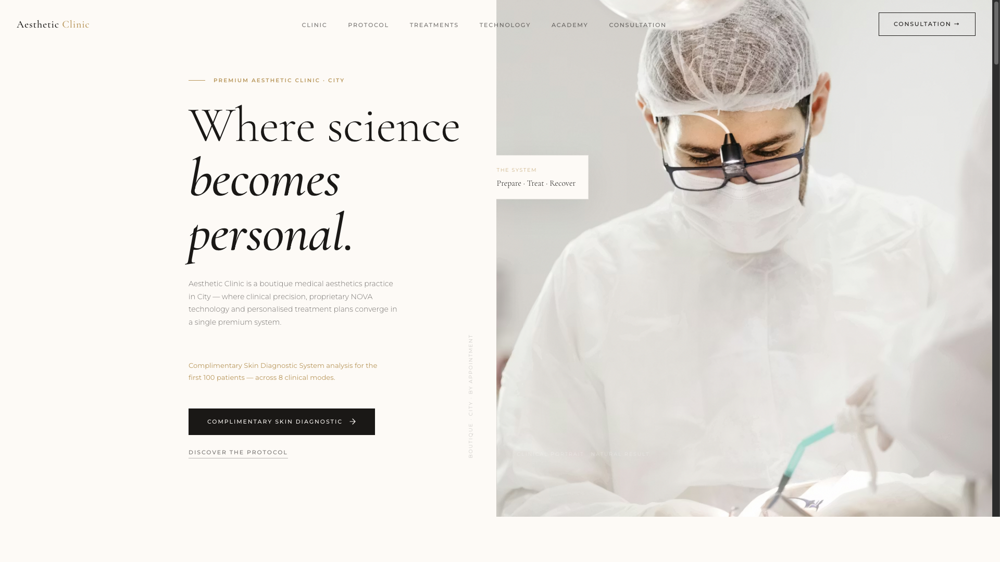
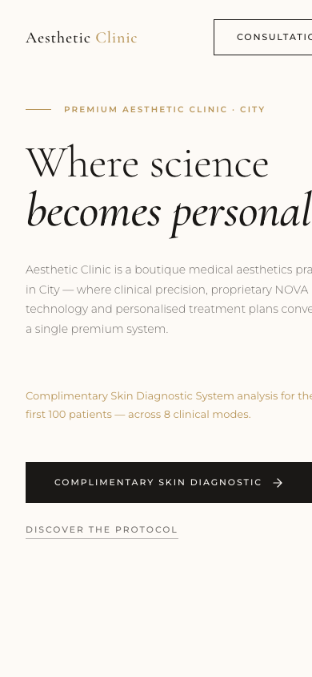
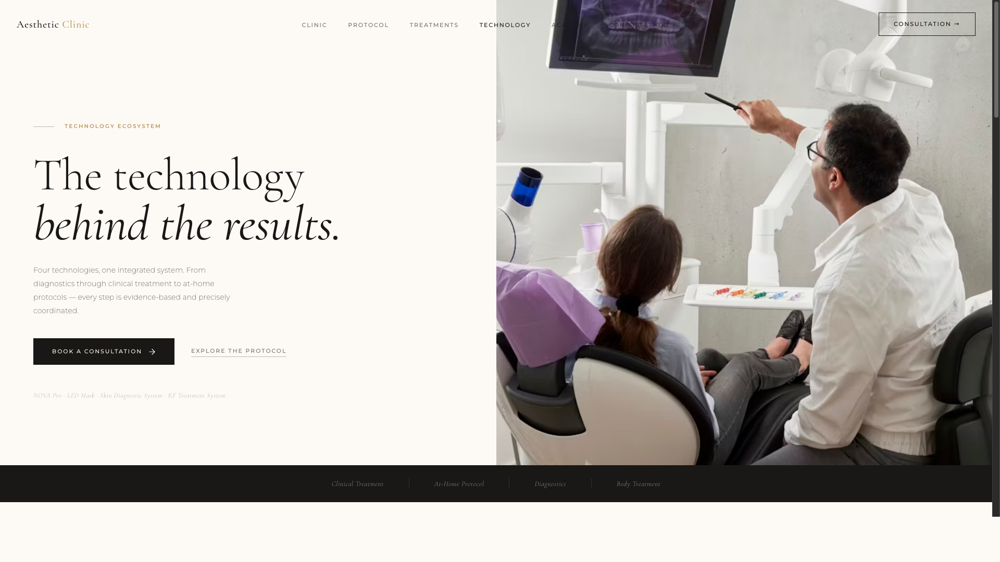
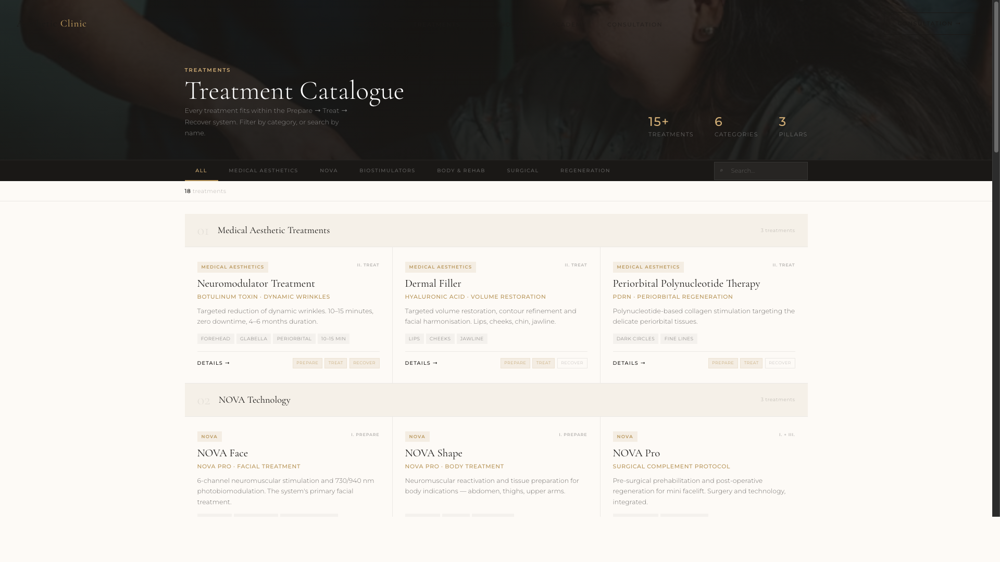
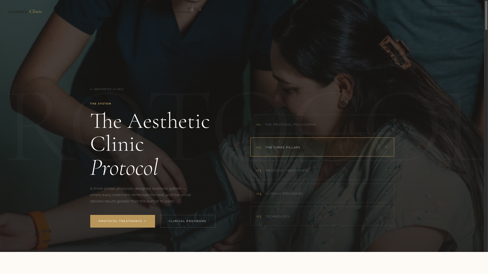
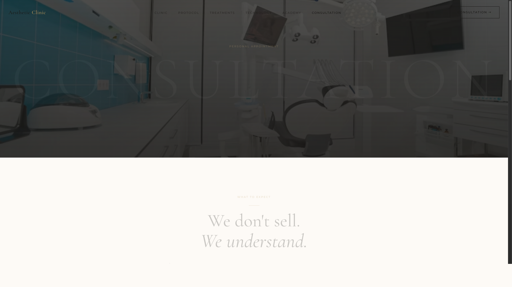
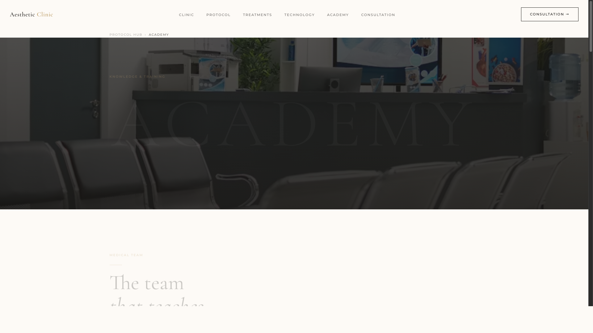

# Aesthetic Clinic Website System

A premium 16-page website template for medical aesthetics clinics. Pure HTML, CSS, and JavaScript — no frameworks, no build tools, no dependencies.



---

## Live Demo

> **[View Live Demo →](https://tianx75.github.io/aesthetic-clinic-website-system/)**

---

## Preview

| Desktop | Mobile |
|---------|--------|
|  |  |

| Technology Hub | Treatments | Protocol |
|---------------|------------|----------|
|  |  |  |

| Consultation | Academy |
|-------------|---------|
|  |  |

---

## Key Features

- **Premium Design** — Cream/ivory/charcoal/gold palette with Cormorant Garamond + Montserrat typography
- **16 Purpose-Built Pages** — Homepage, treatments catalog, protocol system, technology showcases, academy, consultation
- **Fully Responsive** — Desktop, tablet, mobile (1024px / 680px breakpoints)
- **Scroll Animations** — IntersectionObserver-powered reveal effects
- **Filterable Treatment Catalog** — Real-time search + category filter system
- **Technology Showcases** — Interactive device pages with modals
- **Protocol System** — Multi-step treatment methodology with detail pages
- **Consultation Flow** — Booking form with timeline and trust elements
- **CMS-Ready** — 7 collection schemas with Webflow binding documentation
- **Zero Dependencies** — Pure HTML/CSS/JS, deploy anywhere
- **13 Placeholder Images** — Royalty-free AVIF images organized by category
- **SVG Favicon + OG Image** — Ready for production

---

## Pages Included

| Page | File | Purpose |
|------|------|---------|
| Homepage | `the-ultimate-beauty-homepage.html` | Brand positioning and conversion entry |
| Treatments | `kezelesek.html` | Filterable service catalog |
| Consultation | `konzultacio.html` | Lead capture and booking |
| Protocol Hub | `protocol.html` | Treatment methodology overview |
| Protocol Detail | `the-ultimate-beauty-protocol.html` | Deep protocol breakdown |
| Protocol Treatments | `protocol-treatments.html` | Protocol-organized services |
| Protocol Example | `protocol-hialuronsav-szinergia.html` | Specific protocol deep-dive |
| Clinical Programs | `clinical-program.html` | Multi-session programs |
| Technology Hub | `technologia.html` | Device overview page |
| Technology Hub v2 | `technologia-hub-new.html` | Alternate technology layout |
| NOVA Pro Detail | `technologia-hileft.html` | EMS + photobiomodulation device |
| Skin Diagnostics | `technologia-observ.html` | Skin analysis system |
| RF Treatment | `technologia-venus-legacy.html` | Radiofrequency device |
| LED Mask | `technologia-led-mask.html` | LED phototherapy |
| Academy | `akademia.html` | Education and authority |
| Academy v2 | `akademia 2.html` | Alternate academy layout |

---

## Folder Structure

```
aesthetic-clinic-website-system/
├── index.html                              ← GitHub Pages entry point
├── the-ultimate-beauty-homepage.html       ← Main homepage
├── kezelesek.html                          ← Treatments catalog
├── konzultacio.html                        ← Consultation / booking
├── protocol.html                           ← Protocol hub
├── the-ultimate-beauty-protocol.html       ← Protocol detail
├── protocol-treatments.html                ← Protocol treatments
├── protocol-hialuronsav-szinergia.html     ← Protocol example
├── clinical-program.html                   ← Clinical programs
├── technologia.html                        ← Technology hub
├── technologia-hub-new.html                ← Technology hub v2
├── technologia-hileft.html                 ← NOVA Pro detail
├── technologia-observ.html                 ← Diagnostics detail
├── technologia-venus-legacy.html           ← RF treatment detail
├── technologia-led-mask.html               ← LED mask detail
├── akademia.html                           ← Academy
├── akademia 2.html                         ← Academy v2
├── assets/
│   └── images/
│       ├── favicon.svg
│       ├── og-preview.svg
│       ├── hero/              (2 hero backgrounds)
│       ├── clinic/            (2 clinic interiors)
│       ├── treatments/        (4 treatment images)
│       ├── technology/        (2 device images)
│       ├── doctors/           (1 doctor portrait)
│       └── lifestyle/         (2 lifestyle images)
├── screenshots/               (8 preview images)
├── docs/                      (19 documentation files)
├── LICENSE.txt
└── README.md
```

---

## Quick Start

### View Locally

```bash
# Clone the repository
git clone https://github.com/yourusername/aesthetic-clinic-website-system.git
cd aesthetic-clinic-website-system

# Start a local server
python3 -m http.server 8080

# Open in browser
open http://localhost:8080
```

The `index.html` redirects to the main homepage automatically.

### Deploy to GitHub Pages

1. Push the repository to GitHub
2. Go to **Settings → Pages**
3. Set source to **Deploy from a branch**
4. Select **main** branch, **/ (root)** folder
5. Click **Save**
6. Your site will be live at `https://yourusername.github.io/repo-name/`

---

## Customization

### Replace Brand Information

Search and replace these placeholders across all HTML files:

| Find | Replace With |
|------|-------------|
| `Aesthetic Clinic` | Your clinic name |
| `info@yourclinic.com` | Your email |
| `+1 (555) 000-0000` | Your phone |
| `City` | Your city |
| `yourclinic.com` | Your domain |

### Customize Colors

Update CSS custom properties in each file's `:root` block:

```css
:root {
  --cream: #F8F4EE;
  --charcoal: #1A1816;
  --gold: #B8965A;        /* ← Change to your brand accent */
  --gold-light: #D4B077;
}
```

### Replace Images

Swap the AVIF placeholder images in `assets/images/` with your own clinic photography.

See [`docs/SETUP_GUIDE.md`](docs/SETUP_GUIDE.md) for the complete customization reference, and [`docs/DEMO_CONTENT.md`](docs/DEMO_CONTENT.md) for all placeholder content.

---

## Documentation

All documentation is in the [`docs/`](docs/) folder:

| File | Contents |
|------|----------|
| [SETUP_GUIDE.md](docs/SETUP_GUIDE.md) | Technical customization reference |
| [PRODUCT_STRUCTURE.md](docs/PRODUCT_STRUCTURE.md) | Site architecture and conversion logic |
| [CMS_STRUCTURE.md](docs/CMS_STRUCTURE.md) | 7 CMS collections with schemas |
| [DEMO_CONTENT.md](docs/DEMO_CONTENT.md) | All placeholder content reference |
| [ONBOARDING_GUIDE.md](docs/ONBOARDING_GUIDE.md) | 48-hour launch guide |
| [FAQ.md](docs/FAQ.md) | Common buyer questions |
| [FEATURES.md](docs/FEATURES.md) | Complete feature list |
| [FULL_DESCRIPTION.md](docs/FULL_DESCRIPTION.md) | Marketplace listing copy |

---

## Tech Stack

- **HTML5** — Semantic, accessible markup
- **CSS3** — Custom properties, flexbox, grid, media queries
- **Vanilla JavaScript** — IntersectionObserver animations, filter/search
- **Google Fonts** — Cormorant Garamond + Montserrat
- **AVIF Images** — Modern, optimized format

**Browser Support:** Chrome 80+ · Firefox 78+ · Safari 13+ · Edge 80+

---

## License

Commercial template product. Single-use license per purchase. See [LICENSE.txt](LICENSE.txt) for full terms.
